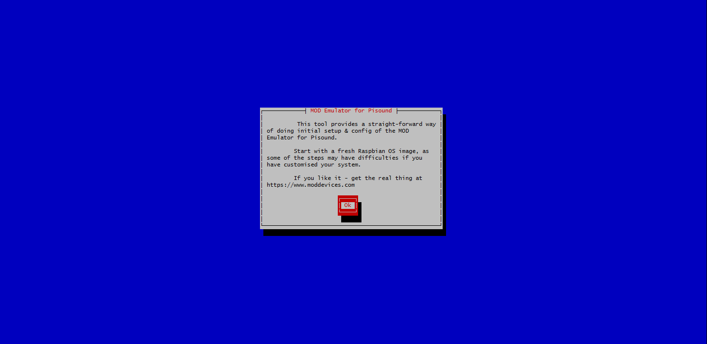
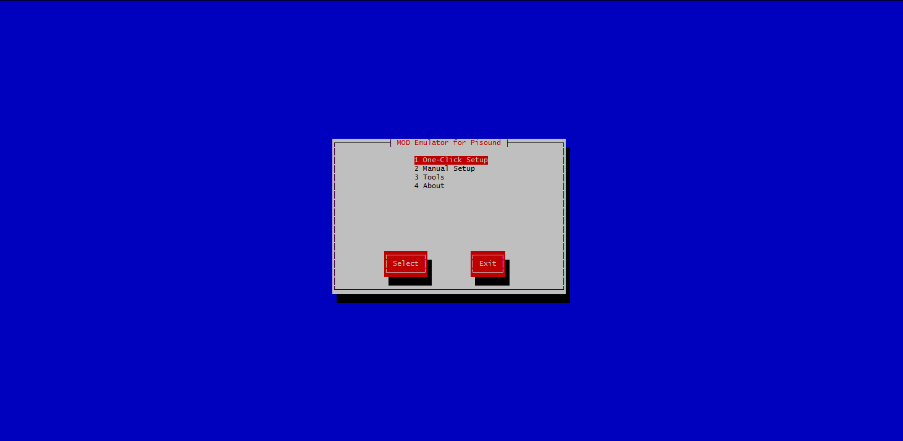
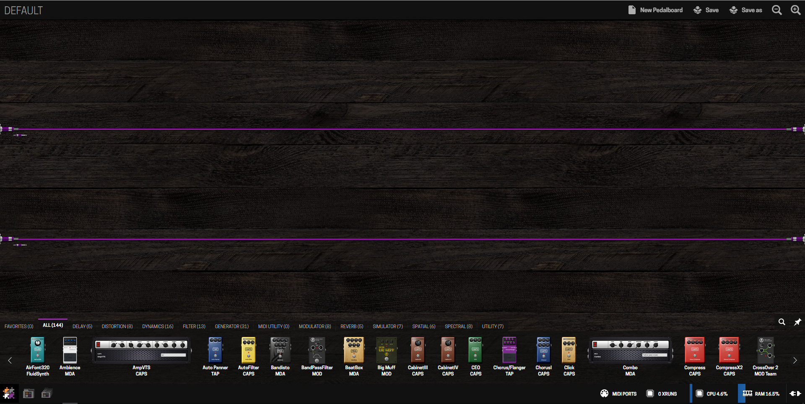

# Moving to https://github.com/BlokasLabs/modep-gen soon!

Find the MODEP Beta image here: https://community.blokas.io/t/beta-modep-2018-01-22/399

# MODEP - MOD Emulator for Pisound

MOD (Musician Operated Device) is a multi-effects pedal that pushes the limit of your guitar, bass, keyboard or any other instrument to craft the sounds you want and reproduce them instantly at home, studio or on a stage.

MODEP is a simple MOD emulator for Raspberry Pi and Pisound.

## Give Credit Where Credit Is Due
None of this would be possible without the MOD team. If you like this emulator, you should get the real thing! More info at https://moddevices.com/

## Prerequisites
- Raspberry Pi 3 MODEL B (https://www.raspberrypi.org/)
- Pisound HAT (http://www.blokas.io/)
- Clean Install of Raspbian Lite OS with SSH enabled (https://www.raspberrypi.org/downloads/raspbian/)

## Setup Instructions

```
wget https://raw.githubusercontent.com/BlokasLabs/modep/master/install.sh
chmod +x install.sh
./install.sh
```
And choose **One-Click Setup** option

To re-run this script, just type this command in a Terminal window:
```
modep
```

## Run

1. Connect your Raspberry Pi to your local network or connect with your computer straight to it via **pisound** access point (psw: blokaslabs)
1. Enter the IP address of your Raspberry Pi in an Internet browser window (172.24.1.1 in case of accessing it via **pisound** hotspot)
1. Enjoy! Thank you!
